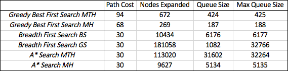
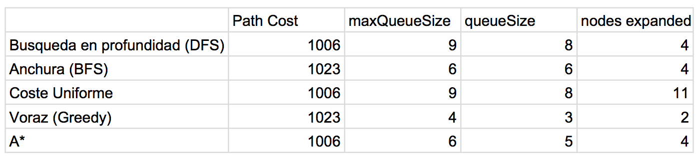

## (1) 

Puzle de 8: 

Breadth first search siempre encuentra una soluciòn optima aunque no es el algoritmo mas eficaz. Comparando los otros algoritmos con Breadth First Search podemos ver cuales son los algoritmos optimos.

Optimos:

- Breadth First Search (ambas heuristicas)
- A* Search (ambas heuristicas)

Non optimos:

 - Greedy (ambas heuristicas)

El algoritmo greedy no es un algoritmo optimo. Elige un camino que parece ser el mas prometedor que però puede ser equivocado. Esto es porque no encuentra la solucion optima. 

Las diferencias de memoria de cada algoritmo se deben al hecho que los algoritmos òptimos necesitan tener en memoria mucha màs informaciòn que el algoritmo greedy que toma una decision basada solamente en el estado actual.

Hay dos candidatos como algoritmos mejores. 
El primero es el *A\* search con heuristica de manhattan (MH)*. Es el algoritmo òptimo que encuentra la soluciòn utilizando menos memoria.
El segundo candidato es el algotirmo no òptimo *Greedy con Heuristica de Manhattan (MH)* porque aunque no encuentra la mejor soluciòn, encuentra una soluciòn acceptable (por el juego considerado) utilizando muy poca memòria. 

Los estados y los operadores del puzle de 8 se definen en:

	aima-core -> src/main/java -> aima.core.environment.eightpuzzle -> EightPuzzleBoard.java
	
Los estados están implementados como vectores desde 0 hasta 9 que indican las posiciones de los numeros y del hueco. Los operadores son funciones que cambian las posiciones de los numeros del vector. 

El test de estado objetivo se define en: 

	aima-core -> src/main/java -> aima.core.environment.eightpuzzle -> EightPuzzleGoalTest.java

Simplemente define un vector que representa el estado objetivo y confronto el estado actual con el estado objetivo. 

La heurìstica Manhattan se define en: 

	aima-core -> src/main/java -> aima.core.environment.eightpuzzle -> ManhattanHeuristicFunction.java
	
La heuristica Manhattan devuelve un numero que representa la suma de las distancias de manhattan de cada numero del estado actual al estado objetivo.

## (2)

Búsqueda en profundidad, anchura, de coste uniforme, voraz y el algoritmo A* con la heurística de la distancia en línea recta.

En el paquete no se puede hacer una bùsqueda desde Senden a Bollingen entoces elegimos hacerlo desde Sidney a Melbourne.

**GraphSearch**

Los algoritmos que encuentran la soluccion optima son:

-	busqueda en profundidad (DFS)
- 	Coste Uniforme
-  A* 

Los algoritmos que no encuentran la soluccion optima

-	Busqueda en Anchura (BFS) 
- 	Voraz (Greedy)

Los algoritmos BFS y Greedy no encuentran la soluciòn optima porquè:
	
1. BFS es optimo solo si el coste de los caminos es uniforme. En este caso el coste no es uniforme entonces elije el camino con menos arcos pero no el màs corto. 
2. El algoritmo Greedy no es òptimo porquè no intenta encontrar el camino òptimo sino intenta encotrar una soluciòn lo antes posible eligiendo cada vez el arco que le parece que pueda satisfacer este criterio.   

Los algoritmos màs eficientes desde el punto de vista de memoria son:
 
 - Voraz
 - A* y Anchura,
 - Profundidad y coste uniforme

Estas diferencias se deben a implementaciones diferentes de la elecciòn del nodo siguente.

No hay un algoritmo mejor en general. Depiende del criterio con que queremos evaluar los algoritmos.
Podrìamos decir que el mejor es el A* porque es el algoritmo òptimo que utliza menos memoria. Tambièn el mejor podrìa ser el algoritmo Voraz porque alcanza una soluciòn buena (buena considerando este problema particolar) y utiliza menos memoria que todos los otros algoritmos.	

Los estados y operadores de la bùsqueda se definen en el paquete:
 
	aima-core -> src/main/java -> aima.core.environment.map 
	

## (3)
*Esquemas generales de búsqueda. Indicad en que paquete se encuentran los esquemas generales de búsqueda TreeSearch y GraphSearch y explicad la diferencia entre ambos.*

Los equemas generales de busqueda se encuentran en el paquete:

	aima-core -> src/main/java -> aima.core.search.framework.qsearch
   	
En GraphSearch tiene una lista de los nodos que ya has explorado y en TreeSeach no tienes esta lista. Entonces puede ser que con TreeSearch entras en un bucle infinito cosa que no puede succeder con GraphSeach porque siempre sabes si ya has visitado un nodo. El problema de Graph search es que puede que necesite de mucha memoria para mantener esta lista si el grafo es muy grande.

## (4)
*Explorad la librería y buscad el esquema de búsqueda primero en anchura. Mirad el código con detenimiento, ¿en qué momento se comprueba si un nodo es objetivo? ¿antes de añadirlo a la frontera o antes de expandirlo? ¿por qué crees que se hace así?*

El algoritmo primero en anchura se puede encontrar en: aima-core -> src/main/java -> aima.core.search.uninformed -> BreadthFirstSearch.java 

Si comprueba si un estado es objetivo antes de anadirlo a la frontera come se puede ver en el codigo: 

	public BreadthFirstSearch(QueueSearch impl) {
		implementation = impl;
		// Goal test is to be applied to each node when it is generated
		// rather than when it is selected for expansion.
		implementation.setEarlyGoalTest(true);
	}

## (5)
*Analizad el código de uno de los algoritmos de búsqueda informada para ver cómo está implementado en la librería.*

*Cual es el algoritmo qué habéis elegido?* 
Hemos elegido el algoritmo A*.

*En que paquete y clase se encuentra su implementación y cómo esta implementado.*

Se encuentra en el paquete aima.core.search.informed y su implementaciòn està en las clases AStarSearch.java y AStarEvaluationFunction.java. 
Està implementado como un BestFirst search que utiliza el criterio de evaluaciòn AStarEvaluationFunction.

