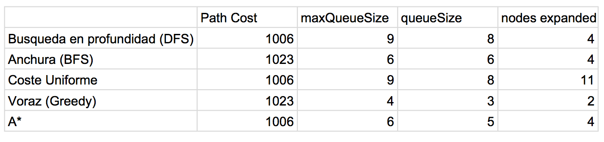

## (1) Puzle de 8

*Greedy Best First Search (Misplaced Tile Heuristic)*

- pathCost : 94.0
- nodesExpanded : 672
- queueSize : 424
- maxQueueSize : 425

*Breadth First Search (Bidirectional search)*

- pathCost : 30.0
- nodesExpanded : 10434
- queueSize : 6176
- maxQueueSize : 6177

*Greedy Best First Search (Manhattan Heurstic)*

- pathCost : 68.0
- nodesExpanded : 269
- queueSize : 187
- maxQueueSize : 188

*A star search Misplaced tile Heurstic*

- pathCost : 30.0
- nodesExpanded : 113020
- queueSize : 31602
- maxQueueSize : 32264

*A star search Manhattan Heuristic*

- pathCost : 30.0
- nodesExpanded : 9627
- queueSize : 5134
- maxQueueSize : 5135

*Breadth First Search (Graph search)*

- pathCost : 30.0
- nodesExpanded : 181058
- queueSize : 1082
- maxQueueSize : 32766

*Analizad el coste de las soluciones encontradas. ¿Son óptimas? En los casos en los que el algoritmo no ha encontrado la solución óptima analizad qué es lo que ha ocurrido.*

Breadth first search siempre encuentra una soluciòn optima aun que no es el algoritmo mas eficaz. 

Optimas:

	- Breadth First Search
	- A* Search

Non optimas:

	- Greedy

	
*Coste de memoria. Analizar la diferencias, respecto al coste de memoria, de los 5 algoritmos y de que se deben estas diferencias?* 

El coste de memoria de cada uno se inferar con el tamaño de el queue porque lo mas grande que es el que se utiliza mas memoria. 

- El coste de Greedy Best First Search es 424
- El coste de Breadth First Search es 6176
- El coste de Greedy Best First Search (Manhattan) es 187
- El coste de A star search (Misplaced tile) es 31602
- El coste de A star search (Manhattan) es 5134
- El coste de BFS Graph Search es 1082

Se deben estas diferencias porque unos utilizan list como una forma de estructura de datos y con esto simplifica el use de memoria.

El coste de memoria son mejores para A* y BFS (bidirectional) porque tienen un coste de 30 que fue lo menos de todos los algoritmos.

El algoritmo que es el mejor para resolver el puzle de 8 es A* (Manhattan heuristic) porque es el mas optimo en complejidad y memoria. Los nodos expandidos son 9627 comparado con 10434 nodos de BFS y la memoria de 5134 comparado con 6176 de BFS.

## (2) Busqueda de Caminos

La búsqueda en profundidad, en anchura, coste uniforme, voraz y el algoritmo A* con la heurística de la distancia en línea recta.

Nuestro paquete no tuvo Senden a Bollingen entoces elegimos Australia, desde Sidney a Melbourne.

GraphSearch

Los algoritmos que encuentran la soluccion optima son:

-	busqueda en profundidad (DFS)
- 	Coste Uniforme
-  A* 

Los algoritmos que no encuentran la soluccion optima

-	Busqueda en Anchura (BFS) 
- 	Voraz (Greedy)

La diferencia en los que son optimas y los que no son, es porque el coste para llegar a Sidney desde Melbourne es mas grande (1023) comparado a (1006) de los optimos. 

*Coste de memoria*

Coste de memoria de Cada uno es diferente porque 

*El mejor de los 5 algoritmos*
	
El mejor de los 5 algoritmos es Voraz proque tiene el menos de coste y un maxQueueSize de 4 que nigun de los otros algoritmos pueden alcanzar. Tambien escoge la decision optima en cada paso para obtener una desicion optima global. 

Los estados y los operadores del RouteFindingAgentApp se definen en:

	aima-core -> src/main/java -> aima.core.environment.map -> Map.java
	

## (3) Las equemas generales de busqueda se encuentran en los siguientes paquetes: 

- TreeSearch: El algoritmo visitara un estado sobre el problema grafico un numero de veces. Incluso es posible visitar un estado un número infinito de veces si se encuentra en un bucle dirigido.

Pseudo-code:

	open <- []
	next <- start

	while next is ~outcome {
	    add successors of next to open
	    next <- select from open
	    remove next from open
	}
	
	return next
	
- GraphSearch: El algoritmo guarda todo los estados que ha visitado y no regresa a ese estado que hace distiguir entre TreeSearch y si mismo. 

Pseudo-code:

	open <- []
	closed <- []
	next <- start
	
	while next is ~outcome {
	    add next to closed
	    add successors of next not in closed to open
	    remove next from open
	    next <- select from open
	}
	
	return next
	
Conclución:

- Graph search require mas memoria, porque guarda todo los estados visitados. Pero puede ser recompensado por una lista oberta chica que mejora la efficiencia del search.

El Paquete donde se puede encontrar TreeSearch y GraphSearch se pueden encontrar debajo de anima-core en la carpeta src/main/java/ (anima.core.search.framework.qsearch) nombrados GraphSearch.java y TreeSearch.java.

## (4) Algoritmo en Anchura (Greedy Algorithm) 

Se encuentra en el paquete de package aima.test.core.unit.search.informed que esta en la carpeta anima-core src/test/java.

*En que momento se comprueba si un estado es objetivo y porque ese creeis se ha tomado esa decision?*

- El momento en que un estado es objetivo es cuando toma la decision optima de cada paso hasta que llega a una global decision optima. 

## (5) Algoritmo de busqueda informada es Breadth First Search. 

Se puede encontrar en el paquete de anima.test.core.unit.search.uninformed que esta en la carpeta anima-core src/test/java.

*Como está implementado?*

-	Está implementado con una list (agent), una estructura de datos abstractos. Tiene una public class llamada BreadFirstSearchTest y dos funciones publicas: testBreadthFirstSuccesfulSearch y testBreadthFirstUnSuccesfulSearch. Tiene una complejidad de O(1) para poner y recibir. 

